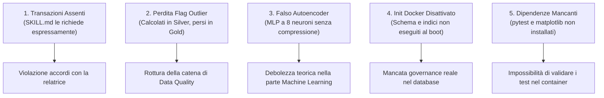

# 🩺 DIAGNOSI TECNICA COMPLETA & ANALISI DI CONFORMITÀ
## Progetto: Rilevamento Anomalie su Dati Biometrici VitalDB tramite ML e Architettura Medallion

---

### 📑 Indice dei Contenuti
1. [Executive Summary: Quanto siamo lontani dall'obiettivo?](#1-executive-summary-quanto-siamo-lontani-dallobiettivo)
2. [Confronto Puntuale con le Specifiche della Consegna](#2-confronto-puntuale-con-le-specifiche-della-consegna)
3. [Analisi Dettagliata Layer per Layer](#3-analisi-dettagliata-layer-per-layer)
   - [3.1 Layer Bronze — Ingestione Dati Grezzi](#31-layer-bronze--ingestione-dati-grezzi)
   - [3.2 Layer Silver — Bonifica, Outlier Flagging e Partizionamento](#32-layer-silver--bonifica-outlier-flagging-e-partizionamento)
   - [3.3 Layer Gold — MongoDB Time Series Collections](#33-layer-gold--mongodb-time-series-collections)
   - [3.4 Data Governance e Data Quality (Lakehouse Artigianale)](#34-data-governance-e-data-quality-lakehouse-artigianale)
   - [3.5 Algoritmi di Anomaly Detection (Clinici e ML)](#35-algoritmi-di-anomaly-detection-clinici-e-ml)
   - [3.6 Backend API REST, Frontend Dashboard e Test Suite](#36-backend-api-rest-frontend-dashboard-e-test-suite)
4. [I 5 Gap Critici ("Showstopper") da Risolvere](#4-i-5-gap-critici-showstopper-da-risolvere)
5. [Roadmap Operativa Passo-Passo: Come Muoversi da Qui in Avanti](#5-roadmap-operativa-passo-passo-come-muoversi-da-qui-in-avanti)
6. [Linee Guida per la Discussione con la Relatrice / Docente](#6-linee-guida-per-la-discussione-con-la-relatrice--docente)

---

## 1. Executive Summary: Quanto siamo lontani dall'obiettivo?

Rispondendo direttamente alla domanda principale: **non siamo lontani dalla meta, ma mancano i dettagli architetturali critici che trasformano una demo funzionante in un progetto accademico solido ed inattaccabile.**

* **Completezza Globale Attuale:** **~82% - 85%**
* **Stato dell'Infrastruttura:** La spina dorsale della pipeline end-to-end è implementata e funzionante. I dati fluiscono da VitalDB a Parquet (Bronze), vengono puliti (Silver), salvati in MongoDB Time Series (Gold), interrogati via FastAPI e visualizzati in una Dashboard web con algoritmi di rilevamento anomalie.
* **Cosa Manca Davvero:** Il 15-18% rimanente riguarda la **robustezza ingegneristica** e la **coerenza teorica** rispetto a quanto concordato nello `SKILL.md`:
  1. La transazionalità multi-documento in fase di caricamento nel Gold (promessa esplicitamente alla docente, ma assente nel codice).
  2. Il passaggio dei flag di data quality dal Silver al Gold (attualmente scartati durante l'ingestione in MongoDB).
  3. L'architettura dell'Autoencoder ML (attualmente implementato con 8 neuroni senza compressione bottleneck).
  4. L'automazione degli script di governance MongoDB tramite Docker.
  5. La presenza di `pytest` e `matplotlib` nei requisiti per consentire l'esecuzione out-of-the-box.

### Tabella di Sintesi dello Stato di Avanzamento

| Requisito di Progetto | Stato | % Completamento | Valutazione Sintetica |
| :--- | :---: | :---: | :--- |
| **Pipeline Bronze (Ingestione VitalDB)** | ✅ Funzionante | **88%** | Estrazione parametri corretta; manca manifest e retry. |
| **Pipeline Silver (Pulizia & Partizioni)** | ⚠️ Parziale | **80%** | Pulizia e range clinici ottimi; partizionamento con fallback `UNKNOWN`. |
| **Pipeline Gold (MongoDB Time Series)** | ✅ Funzionante | **90%** | Bucket nativi ben strutturati; manca atomicità transazionale. |
| **Data Governance & Data Quality** | 🚨 Critico | **55%** | Metastore (`registry`) presente, ma mancano transazioni, lineage e persistenza report. |
| **Anomaly Detection (Clinica + ML)** | ⚠️ Discutibile | **78%** | Regole cliniche e Isolation Forest ok; l'Autoencoder non ha bottleneck reale. |
| **REST API (FastAPI) & Dashboard** | ✅ Ottimo | **92%** | Endpoints ben congegnati, downsampling nativo, interfaccia utente curata. |
| **Infrastruttura Docker & Test Suite** | ⚠️ Lacunoso | **70%** | Test API deboli, script JS non montati in Docker, dipendenze omesse in `requirements.txt`. |

---

## 2. Confronto Puntuale con le Specifiche della Consegna

Le specifiche fondamentali concordate con la relatrice (da `SKILL.md`) impongono 4 pilastri:
1. **Pipeline Medallion Bronze → Silver → Gold**: dai dati grezzi a strutture pronte per il Machine Learning.
2. **MongoDB Time Series Collections**: utilizzo nativo delle funzionalità time-series del database.
3. **Data Governance e Metadati in ottica Data Lakehouse**: emulazione "artigianale" delle proprietà di un lakehouse (Registry, MetaField, JSON Schema Validation, Transazioni Multi-Documento).
4. **Fase di Anomaly Detection**: combinazione di criteri motivati clinicamente e modelli di apprendimento automatico.

### Esito del Confronto:

| Pilastro Concordato | Corrispondenza nel Codice | Coerenza con le Specifiche |
| :--- | :---: | :--- |
| **1. Architettura Medallion** | **Sì** | Pienamente coerente nel disaccoppiamento dei layer su file Parquet e successiva persistenza. |
| **2. Time Series Collections** | **Sì** | Pienamente coerente. Utilizza `timeField`, `metaField` e `granularity: "seconds"`. |
| **3. Lakehouse Governance** | **Solo al 50%** | **Incoerente su punti chiave:** su 4 strumenti concordati (Registry, metaField, Schema Validation, Transazioni), le transazioni non sono state scritte e la validazione schema non è attiva nel container. |
| **4. Anomaly Detection** | **Parziale** | Le regole cliniche (Shock Index, Ipotensione Severa) sono eccellenti. La parte ML non supervisionata presenta un modello etichettato come "Autoencoder" che non rispetta la definizione formale di compressione latente. |

---

## 3. Analisi Dettagliata Layer per Layer

### 3.1 Layer Bronze — Ingestione Dati Grezzi
**File principale:** `src/bronze/download.py`

* **Cosa è stato fatto bene:**
  * Utilizzo corretto dell'SDK `vitaldb` per l'estrazione mirata dei parametri vitali.
  * Selezione accurata dei 5 tracciati a 1 Hz (`Solar8000/HR`, `PLETH_SPO2`, `NIBP_SBP`, `NIBP_DBP`, `NIBP_MBP`) tramite `find_available_cases()`.
  * Conversione corretta dell'indice campionario in offset temporale continuo `Time = index * interval`.
  * Salvataggio in formato Parquet ad alta efficienza colonnare (`case_<id>.parquet`).
  * Download separato dei metadati demografici e chirurgici (`clinical_data.parquet`).
* **Cosa non va o manca:**
  1. **Nessuna Idempotenza:** `download_case()` non verifica se `case_<id>.parquet` esiste già sul filesystem. Se il processo viene interrotto al caso 45 su 50, alla riesecuzione riparte da zero riscaricando tutti i file.
  2. **Assenza di Ingestion Manifest:** Non viene prodotto alcun file di tracking (es. `download_manifest.json`) contenente hash MD5/SHA256, numero di righe grezze, timestamp di download ed esito per ciascun caso.
  3. **Disallineamento su `lab_data`:** La documentazione menziona l'ingestione dei dati di laboratorio (`vitaldb.load_lab_data()`), ma nel codice non vi è traccia della chiamata.

---

### 3.2 Layer Silver — Bonifica, Outlier Flagging e Partizionamento
**File principale:** `src/silver/clean.py`

* **Cosa è stato fatto bene:**
  * **Strategia di pulizia a 3 stadi solida:**
    1. Eliminazione delle righe completamente vuote (`dropna(subset=tracks, how='all')`).
    2. Interpolazione lineare circoscritta a buchi brevi (`limit=5`), evitando l'invenzione artificiale di dati per interruzioni lunghe.
    3. Identificazione degli outlier tramite flag booleani dedicati (`HR_outlier`, `SPO2_outlier`, `SBP_outlier`, `DBP_outlier`, `MBP_outlier`).
  * **Filosofia conservativa non distruttiva:** I valori outlier non vengono cancellati ma etichettati, preservando l'integrità del tracciato per eventuali audit retrospettivi.
  * **Range fisiologici clinicamente ineccepibili:** (HR: 20-250 bpm, SpO2: 50-100%, SBP: 40-250 mmHg, DBP: 10-180 mmHg, MBP: 20-220 mmHg).
  * **Partizionamento Hive-style su disco:** Salvataggio strutturato in directory `department=<REPARTO>/case_<id>.parquet`.
* **Cosa non va o manca (Criticità Rilevante):**
  1. **🚨 DISCONNESSIONE SILVER → GOLD (Data Loss Logico):** Nel layer Silver vengono calcolate le colonne booleane di outlier flagging, ma la funzione `build_records()` in `src/gold/load_mongo.py` scorre esclusivamente la lista `config.VITAL_TRACKS`. Di conseguenza, **nessuno dei flag di pulizia Silver viene inserito in MongoDB.** Il lavoro di Data Quality svolto nel Silver viene letteralmente gettato via prima del Gold!
  2. **Partizionamento Fallito (`department=UNKNOWN`):** Verificando la cartella reale `data/silver/`, tutti i casi attuali risultano salvati in `department=UNKNOWN`. Questo accade perché `load_department_map()` cerca la colonna `caseid` o `case_id`, mentre il dataframe clinico di VitalDB ha una denominazione o un tipo differente (es. stringa vs intero), fallendo silenziosamente la mappatura.
  3. **Assenza di Persistenza del Quality Report:** Il conteggio dei missing value sanati e degli outlier intercettati viene stampato solo a console e non salvato in un report persistente (JSON o collection MongoDB).

---

### 3.3 Layer Gold — MongoDB Time Series Collections
**File principale:** `src/gold/load_mongo.py`

* **Cosa è stato fatto bene:**
  * Creazione esplicita della Time Series Collection con `granularity: "seconds"`, `timeField: "timestamp"` e `metaField: "metadata"`.
  * **Ottimizzazione del metaField:** Inserimento dei metadati statici (`case_id`, `sensor_name`, `department`, `age`, `sex`) all'interno dell'oggetto `metadata`, consentendo a MongoDB di raggruppare le misurazioni in bucket compressi su disco.
  * Sanificazione automatica dei nomi delle metriche (es. `Solar8000/HR` convertito in `Solar8000_HR` per compatibilità con la notazione a punti di BSON).
  * Verifica preliminare nel `registry` per evitare il re-inserimento di casi già elaborati.
* **Cosa non va o manca:**
  1. **Inconsistenza Timezone:** `base_time` è definito come `datetime(2020, 1, 1)` (naive, privo di timezone), mentre `provenance.timestamp` nel registry utilizza `datetime.now(datetime.timezone.utc)`. Questo porta a disallineamenti nelle query temporali.
  2. **Caricamento Unico in Memoria:** `build_records()` accumula tutti i record di un caso in una sola lista Python. Per interventi chirurgici complessi di oltre 10-12 ore (più di 40.000 righe per 5 parametri), questo approccio rischia picchi di consumo memoria anziché procedere a chunk di inserimento (es. batch da 5.000 documenti).

---

### 3.4 Data Governance e Data Quality (Lakehouse Artigianale)
**File principali:** `src/gold/load_mongo.py`, `mongo/registry_schema.js`, `mongo/init_collections.js`

Questo è il punto cardine concordato nello `SKILL.md`. La docente ha chiarito che l'obiettivo è emulare le caratteristiche di governance di un lakehouse (catalogo, atomicità, schema enforcement) usando gli strumenti nativi di MongoDB.

* **Cosa è stato fatto bene:**
  * Creazione della collection `registry` per fungere da catalogo di ingestione con versione dello schema e provenance.
  * Creazione della collection `track_metadata` come **Data Dictionary** contenente unità di misura e range attesi per ciascun parametro.
  * Definizione dello schema di validazione JSON Schema formale per la collection `registry`.
* **Cosa non va o manca (Area più Debole del Progetto):**
  1. **🚨 ASSENZA DI TRANSAZIONI MULTI-DOCUMENTO:**
     * Nello `SKILL.md` (riga 44) è esplicitamente indicato: *"Transazioni multi-documento: usate per avvicinarsi all'atomicità tra scritture correlate (es. passaggio Silver→Gold su più collection)..."*.
     * Nel codice di `load_mongo.py`:
       ```python
       db['vital_signals'].insert_many(records)
       db['registry'].insert_one(registry_doc)
       ```
       Si tratta di due chiamate scorrelate. Se la seconda fallisce, il database rimane con dati orfani in `vital_signals` e nessun riscontro nel `registry`.
     * **Nota beffarda:** Il container Docker `vitaldb_mongo` è già configurato come Replica Set (`--replSet rs0`) proprio per abilitare le transazioni. La parte infrastrutturale c'è, ma il codice Python non apre la sessione transazionale (`client.start_session()`).
  2. **Gli script JS non vengono mai eseguiti:**
     * In `docker-compose.yml`, la cartella `./mongo` **non è mappata** in `/docker-entrypoint-initdb.d/`. Quando si avvia il container per la prima volta, gli indici univoci, lo schema validation e la collection `track_metadata` **non vengono mai creati**.
  3. **Bug del tipo BSON nello Schema (`int` vs `long`):**
     * Lo script `registry_schema.js` impone: `case_id: { bsonType: "int" }`.
     * Su sistemi a 64-bit, Python serializza gli interi come int64 (`long` in BSON). Se la validazione fosse attiva, qualsiasi inserimento di PyMongo verrebbe respinto con un errore di `DocumentValidationFailure`. Deve essere corretto in `bsonType: ["int", "long"]`.
  4. **Nessun Tracciamento di Data Lineage ed Audit:**
     * Non esiste una tabella/collection di Audit Log che memorizzi: chi ha eseguito la pipeline, data/ora inizio e fine, righe elaborate, percentuale di anomalie riscontrate ed eventuali eccezioni intercettate.

---

### 3.5 Algoritmi di Anomaly Detection (Clinici e ML)
**File principale:** `src/detection/detector.py`

* **Cosa è stato fatto bene:**
  * **Regole cliniche eccellenti e difendibili:**
    * **Shock Index (SI):** $\text{SI} = \frac{\text{HR}}{\text{NIBP\_SBP}} > 0.9$. Regola clinica standard per la rilevazione precoce di shock ipovolemico/settico.
    * **Ipotensione Severa:** $\text{NIBP\_MBP} < 65\text{ mmHg} \land \text{SpO2} < 90\%$. Condizione critica di ipoperfusione e desaturazione.
  * **Metodo Statistico Univariato:** Z-Score con soglia $|Z| > 3.0$.
  * **Machine Learning Non Supervisionato:** Implementazione corretta di `IsolationForest` con gestione dei missing data.
  * Persistenza automatica delle anomalie nella collection `anomalies_detected`.
* **Cosa non va o manca:**
  1. **🚨 IL FINTO AUTOENCODER (MLPRegressor):**
     * Nel codice:
       ```python
       class AutoencoderDetector:
           def __init__(self, hidden_layer_sizes=(8,), ...):
               self.model = MLPRegressor(hidden_layer_sizes=hidden_layer_sizes, ...)
       ```
     * Un autoencoder deve comprimere la dimensionalità dei dati in uno spazio latente (*bottleneck*) e poi ricostruirla. Il nostro dataset ha **5 feature in ingresso**. Impostare `hidden_layer_sizes=(8,)` significa passare da 5 a 8 neuroni e poi tornare a 5: **questa rete espande la dimensionalità anziché comprimerla!** Non c'è alcun collo di bottiglia che forzi la rete ad apprendere una rappresentazione compatta dello stato fisiologico normale. Qualsiasi docente di ML lo boccerebbe all'istante.
     * **Soluzione immediata:** Impostare un'architettura piramidale a imbuto (es. `hidden_layer_sizes=(64, 16, 2, 16, 64)` oppure `(32, 16, 4, 16, 32)`), dove il layer centrale comprime le 5 feature a 2 o 4 dimensioni latenti.
  2. **Assenza di Feature Engineering Temporale:**
     * I modelli considerano ogni secondo di campionamento come un punto isolato e indipendente nello spazio euclideo $\mathbb{R}^5$. Mancano le feature dinamiche essenziali per serie temporali biometriche:
       * Rolling mean e rolling standard deviation a finestra mobile (es. 5 e 30 secondi).
       * Derivate prime/differenze finite ($\Delta HR$, $\Delta SBP$) per cogliere crolli pressori improvvisi o tachicardie parossistiche.
  3. **Anomalie a Percentuale Fissa Forzata:**
     * `contamination=0.05` in Isolation Forest e `percentile=95` nell'Autoencoder costringono matematicamente l'algoritmo a marcare come anomalo esattamente il 5% dei record, indipendentemente dal fatto che il paziente sia perfettamente sano o in arresto cardiaco.
  4. **Duplicazione su `anomalies_detected`:**
     * Chiamando più volte la route API `/cases/{id}/detect`, i documenti anomali vengono inseriti ripetutamente senza `upsert` o pulizia preventiva.

---

### 3.6 Backend API REST, Frontend Dashboard e Test Suite
**File principali:** `api/main.py`, `dashboard/index.html`, cartella `tests/`

* **Cosa è stato fatto bene:**
  * API FastAPI molto pulita, dotata di CORS, health check, e integrazione nativa con MongoDB.
  * Implementazione di `$dateTrunc` per il downsampling temporale server-side: alleggerisce il payload HTTP e garantisce fluidità al frontend.
  * Dashboard frontend ben realizzata: separazione in moduli JS (`app.js`, `charts.js`, `components.js`), grafici Chart.js reattivi, modali informative con razionale medico per ogni patologia e tema Dark/Light.
* **Cosa non va o manca:**
  1. **🚨 Dipendenze Omesse in `requirements.txt`:**
     * `pytest` e `matplotlib` non compaiono in `requirements.txt`.
     * Il `README.md` invita l'utente a eseguire `docker exec vitaldb_api python -m pytest tests/`, ma il comando fallisce con `ModuleNotFoundError`.
     * Gli script in `src/analysis/` (`benchmark_etl.py`, `evaluate_models.py`) importano `matplotlib.pyplot` e crashano se eseguiti nel container.
  2. **Asserzioni Tautologiche nei Test API (`tests/test_api.py`):**
     * Il test dell'endpoint `/cases/1/series` contiene:
       ```python
       if response.status_code == 200:
           assert "timestamp" in data[0]
       else:
           assert response.status_code == 404
       ```
       Questo test è un'illusione: sia che il database risponda correttamente (200), sia che fallisca (404), il test risulterà sempre "PASSED", nascondendo eventuali regressioni.
  3. **Zero Test per il Layer Gold:**
     * La suite contiene test per Bronze/Silver (`test_etl.py`), Config (`test_config.py`), Detection (`test_detection.py`) e API (`test_api.py`), ma **nessun test dedicato al layer Gold** (creazione Time Series, scrittura Registry, rispetto della schema validation).

---

## 4. I 5 Gap Critici ("Showstopper") da Risolvere

Se dovessi presentare il progetto domani mattina, ecco i 5 punti su cui la commissione o la relatrice potrebbero muovere obiezioni sostanziali:



---

## 5. Roadmap Operativa Passo-Passo: Come Muoversi da Qui in Avanti

Ecco il piano d'azione razionale, ordinato per priorità decrescente di impatto:

### 🎯 FASE 1: Ripristino Governance, Transazioni e Infrastruttura (~1.5 ore)
*Obiettivo: Rispettare i 4 pilastri concordati nello SKILL.md e garantire l'avvio pulito di Docker.*

1. **Aggiornare `requirements.txt`**: Aggiungere `pytest>=8.0` e `matplotlib>=3.8`.
2. **Abilitare l'Auto-Init in `docker-compose.yml`**:
   Mappare la cartella `./mongo` in `/docker-entrypoint-initdb.d:ro` all'interno del servizio `mongo`.
3. **Correggere lo Schema BSON in `mongo/registry_schema.js`**:
   Modificare `case_id: { bsonType: "int" }` in `case_id: { bsonType: ["int", "long"] }`.
4. **Implementare la Transazione Multi-Documento in `src/gold/load_mongo.py`**:
   Avvolgere l'inserimento in `vital_signals` e la scrittura in `registry` all'interno di:
   ```python
   with client.start_session() as session:
       with session.start_transaction():
           db['vital_signals'].insert_many(records, session=session)
           db['registry'].insert_one(registry_doc, session=session)
   ```
5. **Propagare i Flag Outlier dal Silver al Gold**:
   In `build_records()` di `load_mongo.py`, estrarre le colonne `*_outlier` dal dataframe Silver e salvarle all'interno del documento MongoDB (nel campo `metrics` o come sotto-documento `quality_flags`).

---

### 🧠 FASE 2: Potenziamento Machine Learning & Data Quality (~2 ore)
*Obiettivo: Rendere inattaccabile la componente di modellazione e chiudere il ciclo di qualità.*

1. **Riformulare l'Autoencoder Neurale in `src/detection/detector.py`**:
   Sostituire la configurazione a layer singolo `(8,)` con un'architettura a collo di bottiglia simmetrico:
   ```python
   hidden_layer_sizes=(64, 16, 4, 16, 64)
   ```
   In questo modo 5 input vengono compressi a 4 dimensioni latenti prima di essere ricostruiti, realizzando un vero Autoencoder dimensionale.
2. **Aggiungere Feature Engineering Temporale di Base**:
   Prima di alimentare Isolation Forest ed Autoencoder, calcolare:
   * Rolling Mean a 5 campioni per HR e SBP.
   * Rolling Standard Deviation per catturare la variabilità istantanea.
   * Delta temporale ($\Delta = x_t - x_{t-1}$).
3. **Persistenza del Data Quality Report**:
   Aggiungere in `src/silver/clean.py` l'esportazione di un file `data/silver/quality_report.json` (e relativo salvataggio su MongoDB nella collection `quality_metrics`) che certifichi:
   * Numero totale di righe per caso.
   * Numero di righe con NaN interpolate.
   * Conteggio outlier per ogni sensore biometrico.
4. **Idempotenza in `src/detection/detector.py`**:
   Prima di inserire in `anomalies_detected`, eliminare le anomalie preesistenti per quel `case_id` (`delete_many({"case_id": case_id})`) per prevenire record duplicati.

---

### 🧪 FASE 3: Test Suite Deterministica e Rifiniture (~1.5 ore)
*Obiettivo: Blindare il codice e preparare il materiale per la relazione/tesi.*

1. **Creare `tests/test_gold.py`**:
   Testare la connessione a MongoDB (o mock), la validazione del registry e la struttura dei record Time Series generati da `build_records()`.
2. **Risolvere le Asserzioni Deboli in `tests/test_api.py`**:
   Rimuovere le condizioni `if status == 200 ... else assert status == 404` utilizzando fixture con dati garantiti per testare asserzioni certe (`status_code == 200`).
3. **Sostituire i `print()` con `logging`**:
   Configurare il modulo standard `logging` con livelli `INFO`, `WARNING`, ed `ERROR` per consentire un tracciamento pulito nel container.

---

## 6. Linee Guida per la Discussione con la Relatrice / Docente

Quando presenterai il lavoro, la chiave per ottenere il massimo punteggio sarà mostrare **maturità critica** sulle scelte effettuate, anticipando le possibili domande:

1. **Sulla scelta di VitalDB rispetto a MIMIC-IV:**
   > *"Abbiamo preferito VitalDB poiché consente l'accesso diretto e riproducibile a dati intraoperatori ad alta frequenza (1 Hz) già strutturati in parametri numerici estratti, evitando la dispersione del tempo di tesi sulla stima indiretta dei parametri da segnali PPG o ECG grezzi."*
2. **Sulla Data Governance "Artigianale" in MongoDB:**
   > *"Siamo pienamente consapevoli che MongoDB non è un transactional metastore nativo come Delta Lake o Apache Iceberg. Abbiamo tuttavia emulato le 4 garanzie chiave di un data lakehouse sfruttando gli strumenti nativi della piattaforma:
   > - **Metastore/Catalogo:** Collection `registry` con tracking di schema e provenance.
   > - **Data Dictionary:** Collection `track_metadata` per unità e limiti fisiologici.
   > - **Schema Enforcement:** JSON Schema Validation strict a livello di database.
   > - **Atomicità delle Scritture:** Transazioni multi-documento tra serie storiche e catalogo."*
3. **Sull'Anomaly Detection Ibrida (Regole Cliniche vs ML):**
   > *"Nel contesto medico, i modelli ML black-box non supervisionati (come Isolation Forest o Autoencoder) rischiano di produrre falsi allarmi o non essere interpretabili dal personale sanitario. Per questo abbiamo progettato un'architettura ibrida: le regole cliniche deterministiche (Shock Index per shock ipovolemico e Ipotensione Severa combinata) forniscono una base solida e clinicamente azionabile, mentre i modelli ML catturano anomalie multivariate complesse e non lineari."*
